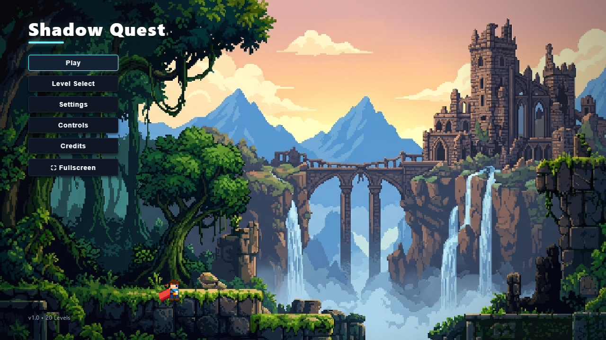
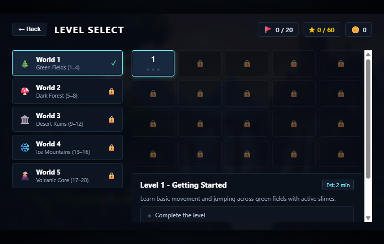
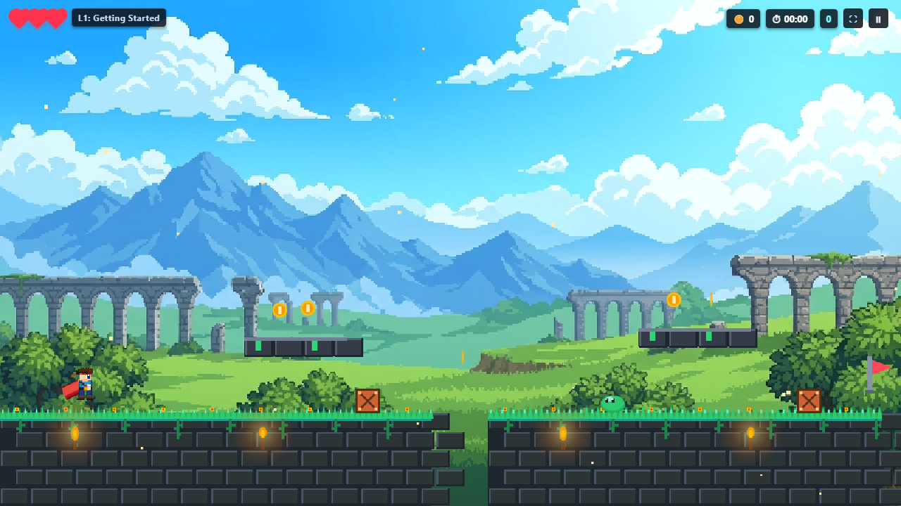
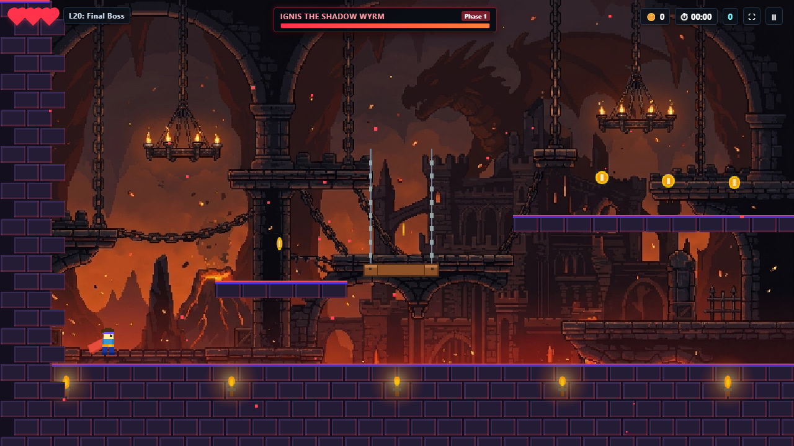

#play live = https://shadow-blade-2d.netlify.app/


# Shadow Quest

A complete 20-level 2D side-scrolling platformer crafted with pure HTML5 Canvas, Vanilla JavaScript, CSS3, and Web Audio API. Inspired by the gameplay feel of *Celeste*, *Super Mario World*, *Hollow Knight*, and *Rayman Legends*.

---

## Screenshots

| Main Menu | Level Select |
| :---: | :---: |
|  |  |

| World 1 Gameplay | World 5 Boss Chamber |
| :---: | :---: |
|  |  |

---

## Features

- **20 Handcrafted Levels across 5 Worlds**:
  - **World 1**: Green Fields (Levels 1–4) — Introduction to jumps, wooden platforms, and slimes.
  - **World 2**: Dark Forest (Levels 5–8) — Twilight canopy, bats, aggressive mushrooms, and moving ledges.
  - **World 3**: Desert Ruins (Levels 9–12) — Sandstone columns, crumbling platforms, and the Stone Golem mid-boss.
  - **World 4**: Ice Mountains (Levels 13–16) — Frozen peaks, slippery ice friction, and narrow spikes.
  - **World 5**: Volcanic Core & Dark Castle (Levels 17–20) — Magma hazards, sawblades, falling thwomps, and the 4-phase Final Dragon Boss.
- **Dynamic Multi-Layer Parallax Backgrounds**:
  - High-definition 16:9 pixel-art backgrounds rendered with depth-aware horizontal parallax scrolling.
- **Refined Platformer Physics**:
  - Frame-rate independent physics engine with acceleration, ground friction, and ice slip physics.
  - Coyote time (0.12s) and jump buffering (0.12s) for responsive jumping.
  - Wall sliding and wall jumping mechanics.
  - Directional collision resolution preventing ground tile edge catches.
- **Hero Character & Combat**:
  - Billowing 3-tier crimson cape with dynamic wave physics.
  - Stomp bounce on enemies or broadsword slash with luminous energy arc.
  - Squash and stretch animation on jumps and landings.
- **Web Audio API Sound Engine**:
  - 100% procedural retro sound effects (jumps, coins, sword slashes, hurt, death, checkpoints, level clears).
  - 5 original procedural world music tracks.
- **Save System & Progression**:
  - Saves unlocked levels, high scores, best completion times, total coins, and 3-star level objectives to localStorage.
- **Fullscreen & Responsive**:
  - Fullscreen toggle (<kbd>F</kbd> key or in-game button) supporting seamless display scaling with 16:9 aspect-ratio clamping.
  - Optional on-screen touch controls for coarse pointer touch devices.

---

## Controls

| Action | Keyboard | Touch |
| --- | --- | --- |
| Move Left | <kbd>A</kbd> / <kbd>←</kbd> | ◀ |
| Move Right | <kbd>D</kbd> / <kbd>→</kbd> | ▶ |
| Jump (Hold for high jump) | <kbd>W</kbd> / <kbd>↑</kbd> / <kbd>Space</kbd> | ▲ |
| Sword Attack | <kbd>J</kbd> / <kbd>Z</kbd> / <kbd>X</kbd> / <kbd>C</kbd> | ⚔️ |
| Toggle Fullscreen | <kbd>F</kbd> | ⛶ Button |
| Pause Game | <kbd>ESC</kbd> / <kbd>P</kbd> | ⏸ Button |

---

## How to Run

1. Open `platformer/index.html` (or the root `index.html`) directly in any modern web browser.
2. Or serve locally with any static web server:
   ```bash
   python -m http.server 8080
   ```
   and navigate to `http://localhost:8080/`.
